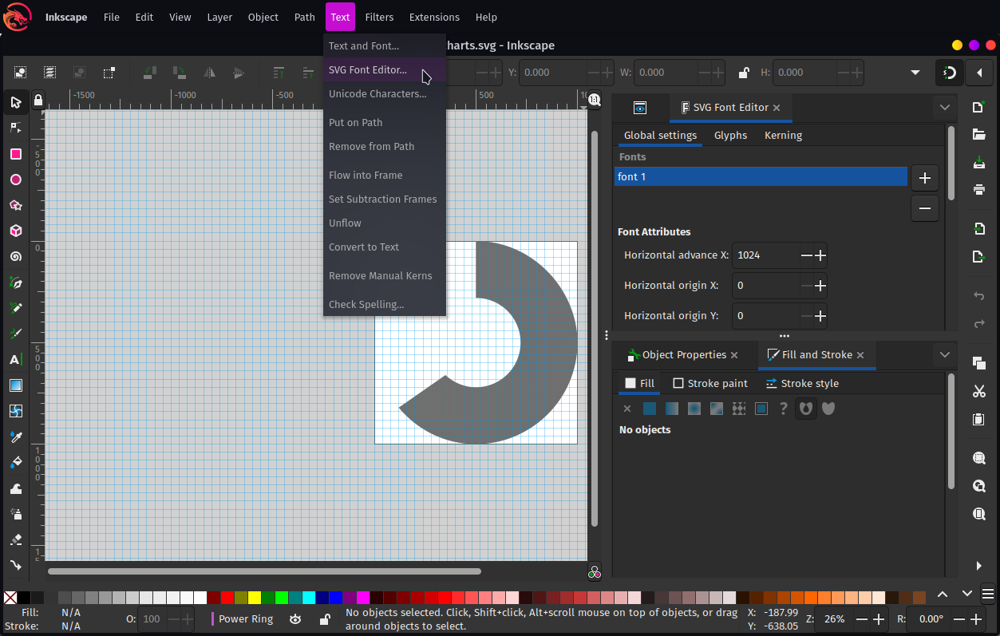

#  PIcons
This project has the source SVG for the icon fonts used in [Panintelligence](https://panintelligence.com).

[You can see all the icons here](https://panintelligence.github.io/picons.html).

# Usage
If you want to experiment, you can just use the url from `githack.com` which serves as an automatic CDN for github-hosted files:
```html
<link href="https://raw.githack.com/Panintelligence/picons/master/dist/css/picons-charts.css" rel="stylesheet">
```

Please do not use the URL above in production as githack will throttle requests to that URL if there are too many.

In production, you should do the following:

1. [Download the artifact from the releases page](https://github.com/Panintelligence/picons/releases)
2. Copy `css/picons-charts.css` into your css folder
3. Copy all the fonts inside `fonts` to your fonts folder

If you look inside `picons-charts.css`, it expects the fonts to be one level above and inside `fonts`:
```css
@font-face {
    font-family: 'picons-charts';
    src:  url('../fonts/picons-charts.eot?u53g43');
    src:  url('../fonts/picons-charts.eot?u53g43#iefix') format('embedded-opentype'),
        url('../fonts/picons-charts.ttf?u53g43') format('truetype'),
        url('../fonts/picons-charts.woff?u53g43') format('woff'),
        url('../fonts/picons-charts.svg?u53g43#picons-charts') format('svg');
    font-weight: normal;
    font-style: normal;
}
```

Feel free to change these paths to whatever suits you.

# Developing and contributing

## Editing the fonts
Use any vector-based editor. I like to use [inkscape](https://inkscape.org/), but you can edit the fonts using [fontforge](https://fontforge.github.io/) too.

### Configuring Inkscape

You'll want the SVG Font Editor so you can bring it up via Text -> SVG Font Editor:



You can find out more [here](https://inkscape-manuals.readthedocs.io/en/latest/creating-custom-fonts.html).

## Generating fonts
### Requirements

* [fontforge](https://fontforge.github.io/)
* Python 3

To build all the fonts run:
```bash
./build.sh
```
